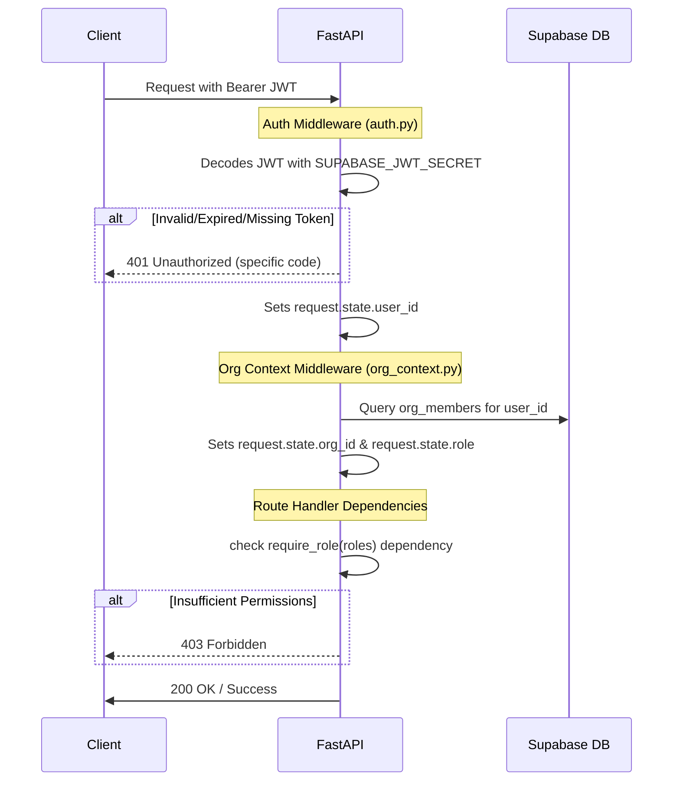

# 03. Authentication & Middleware

This document outlines the authentication architecture, token verification steps, context injection middleware, and Role-Based Access Control (RBAC) dependencies.

---

## 1. Authentication Lifecycle

Recruiter-X relies on Supabase GoTrue for authentication. The client authenticates with Supabase, obtains a JWT, and sends it on every request.



---

## 2. JWT Verification Middleware (`middleware/auth.py`)

Write the JWT parsing and decoding middleware. The token must be decoded using python-jose or PyJWT.

### Configuration Variables
*   `SUPABASE_JWT_SECRET`: Secret key used to decode token.
*   Algorithm: `HS256`
*   Audience claim: `authenticated`

### Rules
1.  Verify the `Authorization` header is present and begins with `Bearer `.
2.  Decode and verify the signature, expiration, and audience.
3.  If any check fails, raise `HTTPException(status_code=401, detail=...)` with a specific machine-readable error code.
4.  Store `sub` claim value (the UUID of the user) in `request.state.user_id`.

### Code Blueprint
```python
# middleware/auth.py
from fastapi import Request, HTTPException
from jose import jwt, JWTError
from config import settings

async def authenticate_jwt(request: Request):
    auth_header = request.headers.get("Authorization")
    if not auth_header or not auth_header.startswith("Bearer "):
        raise HTTPException(
            status_code=401,
            detail={"code": "MISSING_BEARER_TOKEN", "message": "Authorization header must be Bearer token."}
        )
        
    token = auth_header.split(" ")[1]
    try:
        payload = jwt.decode(
            token,
            settings.SUPABASE_JWT_SECRET,
            algorithms=["HS256"],
            audience="authenticated"
        )
        user_id = payload.get("sub")
        if not user_id:
            raise HTTPException(
                status_code=401,
                detail={"code": "INVALID_TOKEN_SUB", "message": "Token payload missing 'sub' claim."}
            )
        request.state.user_id = user_id
    except jwt.ExpiredSignatureError:
        raise HTTPException(
            status_code=401,
            detail={"code": "TOKEN_EXPIRED", "message": "The provided authentication token has expired."}
        )
    except JWTError as e:
        raise HTTPException(
            status_code=401,
            detail={"code": "INVALID_TOKEN", "message": f"Token validation failed: {str(e)}"}
        )
```

---

## 3. Org Context Middleware (`middleware/org_context.py`)

Once the user is verified, resolve their organizational scope. 

### Rules
1.  Read `request.state.user_id`.
2.  Query the `org_members` database table to find the organization user mapping.
3.  Inject:
    *   `request.state.org_id`: The UUID of the organization.
    *   `request.state.role`: The user role within this org (`owner`, `admin`, `recruiter`, `viewer`).
4.  If the user is not associated with any organization, raise `HTTPException(status_code=403, detail=...)`.

### Code Blueprint
```python
# middleware/org_context.py
from fastapi import Request, HTTPException
from services.supabase_client import get_supabase_client

async def inject_org_context(request: Request):
    user_id = getattr(request.state, "user_id", None)
    if not user_id:
        return # Skip if route is public
        
    supabase = get_supabase_client()
    response = supabase.table("org_members") \
        .select("org_id, role") \
        .eq("user_id", user_id) \
        .execute()
        
    if not response.data or len(response.data) == 0:
        raise HTTPException(
            status_code=403,
            detail={"code": "NO_ORGANISATION_MEMBERSHIP", "message": "User is not a member of any organization."}
        )
        
    member_record = response.data[0]
    request.state.org_id = member_record["org_id"]
    request.state.role = member_record["role"]
```

---

## 4. RBAC Dependency Injection (`require_role`)

Secure routes using role-based dependencies in route definitions.

### Allowed Roles
*   `owner`, `admin`, `recruiter`, `viewer`

### Code Blueprint
```python
# utils/auth_dependencies.py
from fastapi import Request, HTTPException, Depends

class RequireRole:
    def __init__(self, allowed_roles: list[str]):
        self.allowed_roles = allowed_roles
        
    def __call__(self, request: Request):
        user_role = getattr(request.state, "role", None)
        if not user_role or user_role not in self.allowed_roles:
            raise HTTPException(
                status_code=403,
                detail={
                    "code": "INSUFFICIENT_PERMISSIONS", 
                    "message": f"Action requires one of the following roles: {self.allowed_roles}. Current role: {user_role}"
                }
            )
            
# Helper usage examples:
# require_admin = Depends(RequireRole(["owner", "admin"]))
# require_recruiter = Depends(RequireRole(["owner", "admin", "recruiter"]))
```
