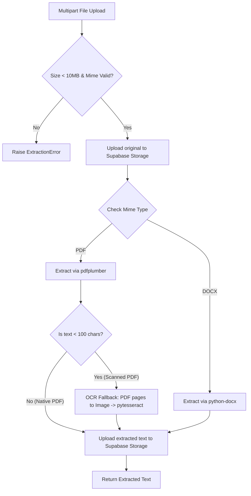

# 05. Resume Ingestion Pipeline

This document defines the ingestion pipeline for parsing resume uploads in PDF and DOCX formats, including OCR fallback for scanned PDFs and storage of files in Supabase Storage.

---

## 1. Pipeline Flow

When a resume is uploaded, it passes through the following validation and parsing lifecycle:



---

## 2. Ingestion Rules & Functions (`services/resume_extractor.py`)

Implement the parsing logic inside `services/resume_extractor.py` using the following guidelines.

### 1. File Validation
Before passing a file to extractors, check:
*   **Allowed MIME Types:** `application/pdf` or `application/vnd.openxmlformats-officedocument.wordprocessingml.document` (DOCX).
*   **File Size Limit:** 10MB.
*   **Error Handling:** Raise `ExtractionError` with a specific error message if validation fails.

### 2. PDF Parsing (`pdfplumber`)
Extract text page-by-page. Combine the pages with newline delimiters.

### 3. OCR Fallback (`pytesseract`)
*   **Trigger:** If the text extracted by `pdfplumber` is fewer than 100 characters after stripping whitespace, classify the PDF as scanned.
*   **Process:** Convert PDF pages to PIL images (using `pdf2image`), run `pytesseract.image_to_string` on each page, and concatenate the output.

### 4. DOCX Parsing (`python-docx`)
Iterate through paragraphs in the Word document, gather text, and join them with newlines.

---

## 3. Storage Specifications (`services/storage.py`)

All files must be saved in Supabase Storage with strict isolation policies.

### Storage Layout Paths:
*   **Original uploaded resume:** `resumes/{org_id}/{project_id}/{candidate_id}/original.{ext}`
*   **Extracted plaintext document:** `resumes/{org_id}/{project_id}/{candidate_id}/extracted.txt`

### Security Rule: Signed URLs Only
1.  Supabase bucket must be **private**.
2.  All read and write operations from the web app must use signed URLs generated with a maximum expiry of **1 hour**.
3.  The backend service accesses files programmatically using the admin client.

### Code Blueprint
```python
# services/resume_extractor.py
import pdfplumber
import docx
import pytesseract
from pdf2image import convert_from_bytes
from io import BytesIO
from utils.errors import ExtractionError

def validate_file(file_content: bytes, content_type: str):
    if len(file_content) > 10 * 1024 * 1024:
        raise ExtractionError("File size exceeds the 10MB limit.")
        
    allowed_types = [
        "application/pdf",
        "application/vnd.openxmlformats-officedocument.wordprocessingml.document"
    ]
    if content_type not in allowed_types:
        raise ExtractionError(f"Unsupported file format: {content_type}. Only PDF and DOCX are allowed.")

def extract_pdf(file_bytes: bytes) -> str:
    text = ""
    with pdfplumber.open(BytesIO(file_bytes)) as pdf:
        for page in pdf.pages:
            extracted = page.extract_text()
            if extracted:
                text += extracted + "\n"
    return text

def is_likely_scanned(extracted_text: str) -> bool:
    return len(extracted_text.strip()) < 100

def ocr_fallback(file_bytes: bytes) -> str:
    try:
        images = convert_from_bytes(file_bytes)
        text = ""
        for img in images:
            text += pytesseract.image_to_string(img) + "\n"
        return text
    except Exception as e:
        raise ExtractionError(f"OCR translation failed: {str(e)}")

def extract_docx(file_bytes: bytes) -> str:
    try:
        doc = docx.Document(BytesIO(file_bytes))
        return "\n".join([p.text for p in doc.paragraphs])
    except Exception as e:
        raise ExtractionError(f"Word document extraction failed: {str(e)}")

def extract_text(file_bytes: bytes, content_type: str) -> str:
    validate_file(file_bytes, content_type)
    
    if content_type == "application/pdf":
        raw_text = extract_pdf(file_bytes)
        if is_likely_scanned(raw_text):
            return ocr_fallback(file_bytes)
        return raw_text
    elif content_type == "application/vnd.openxmlformats-officedocument.wordprocessingml.document":
        return extract_docx(file_bytes)
    else:
        raise ExtractionError("Invalid file type routed to extractor.")
```
