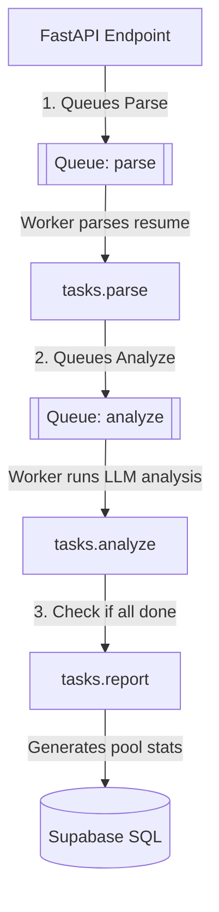

# 06. Celery Worker Architecture & Task Queues

This document describes the task queue topology, Celery worker configurations, and execution step dependencies for analyzing candidate resumes.

---

## 1. Queue Topology

We run a multi-queue configuration to separate fast, CPU-bound extraction jobs from slow, network-bound LLM analyses and project report creations.



### Queue Specifications:
1.  **`parse` Queue:** Dedicated to extraction tasks (PDF/DOCX/OCR text parsing). High concurrency, fast throughput.
2.  **`analyze` Queue:** Dedicated to LLM calls. Medium concurrency, rate-controlled to prevent hitting LLM provider rate limits.
3.  **`report` Queue:** Dedicated to pool report generation. Low concurrency, quick execution.

---

## 2. Celery Configurations (`celery_app.py`)

To ensure job durability and zero dropped jobs, configure `celery_app.py` with these exact parameters:

```python
# celery_app.py
from celery import Celery
from config import settings

app = Celery(
    "recruiter_x",
    broker=settings.REDIS_URL,
    backend=settings.REDIS_URL
)

app.conf.update(
    task_default_queue="parse",
    # Ensure tasks are only acknowledged AFTER successful completion (prevents loss on crash)
    task_acks_late=True,
    # Re-queue the task if the worker gets killed or lost mid-run
    task_reject_on_worker_lost=True,
    # Keep task results in Redis for 1 hour only to prevent memory bloat
    result_expires=3600,
    # Explicit task routing
    task_routes={
        "tasks.parse.*": {"queue": "parse"},
        "tasks.analyze.*": {"queue": "analyze"},
        "tasks.report.*": {"queue": "report"},
    }
)
```

---

## 3. Worker Tasks

### Task 1: Parse Resume (`tasks/parse.py`)
*   **Args:** `candidate_id: str, org_id: str`
*   **Actions:**
    1.  Fetch the resume file metadata from the `candidates` table.
    2.  Download the document bytes.
    3.  Run `extract_text()`.
    4.  Update candidate: set `resume_raw_text = parsed_text` and `analysis_status = 'parsed'`.
    5.  Trigger the `analyze` task for this candidate.
*   **Failure Rule:** If parsing fails (e.g. invalid file, OCR failure), set candidate `analysis_status = 'failed'` and record the error message.

### Task 2: Multi-step AI Analysis (`tasks/analyze.py`)
This is a pipeline of sequential LLM operations with dependency constraints.

#### Step Execution Flow:
```text
Phase A: Concurrent Inputs (Run trajectory, behaviour, and credibility in parallel)
  ├── trajectory = LLMRouter.complete(trajectory_prompt)
  ├── behaviour = LLMRouter.complete(behaviour_prompt)
  └── credibility = LLMRouter.complete(credibility_prompt)

Phase B: Dependency Analysis (Runs after Phase A completes)
  └── insider_signal = LLMRouter.complete(insider_prompt, inputs=[trajectory, credibility])

Phase C: Comparison (Runs after Phase B completes)
  └── ghost_comparison = LLMRouter.complete(ghost_comparison_prompt, inputs=[trajectory, behaviour, credibility, insider_signal])

Phase D: Finalization (Runs after Phase C completes)
  ├── final_score = ScoreFusion.calculate(trajectory, behaviour, ghost_comparison, insider_signal, credibility)
  └── interrogation_questions = LLMRouter.complete(interrogation_prompt, inputs=[red_flags])
```

#### Retry & Backoff Logic:
*   **Provider Rate Limits / Timeouts:** If the LLM throws a `RateLimitError` or `APITimeoutError`, retry using tenacity:
    *   `exponential_backoff`: multiplier=1, min=4s, max=30s.
    *   Maximum attempts: 3.
*   **API Authentication Failures:** If `APIAuthError` (e.g. invalid key) is raised, **do not retry**. Immediately set candidate status to `failed`, log the specific authentication code, and flag the API key as inactive.

### Task 3: Pool Health Aggregator (`tasks/report.py`)
*   **Args:** `project_id: str, org_id: str`
*   **Actions:**
    1.  Query all completed candidate records for the project.
    2.  Calculate overall metrics (e.g., average scores, qualified percentage, inflation rates, hidden gems).
    3.  Store the JSON report in `projects.jd_structured` and set project status to `complete`.
