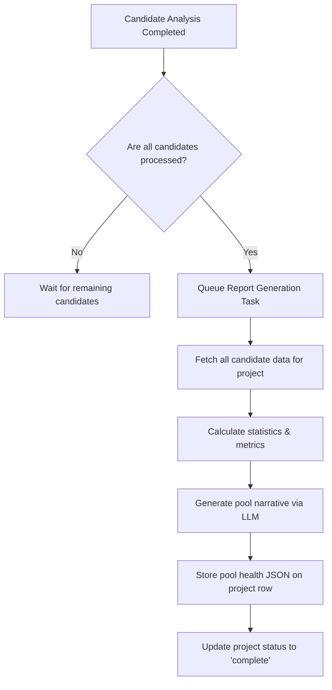

# 09. Pool Health Aggregator

This document details the aggregation logic inside `services/pool_aggregator.py`. It details how individual candidate assessments are synthesized into a single high-level dashboard.

---

## 1. Aggregation Lifecycle



---

## 2. Report JSON Schema

The output generated by `build_pool_report` is saved on the project's `jd_structured` JSONB column under the key `pool_report`.

```json
{
  "total_applicants": 45,
  "actually_qualified": 12,
  "qualification_rate_percentage": 26.6,
  "average_inflation_rate": 18.5,
  "honest_candidate_rate": 78.2,
  "most_over_claimed_skill": "Kubernetes",
  "most_under_claimed_skill": "SQL Optimization",
  "score_distribution": {
    "0_to_25": 3,
    "26_to_50": 15,
    "51_to_75": 20,
    "76_to_100": 7
  },
  "trajectory_distribution": {
    "Accelerating": 15,
    "Steady": 22,
    "Plateaued": 7,
    "Declining": 1
  },
  "hidden_gems": [
    {
      "candidate_id": "8f89ea34-d021-4f9e-b9b5-7798da2b3a1a",
      "name": "Jane Miller",
      "final_score": 52,
      "insider_score": 79,
      "reason": "Jane's resume uses dry, unpolished bullet points causing a low trajectory score, but her technical descriptions show deep experience resolving production memory leaks."
    }
  ],
  "jd_warnings": [
    {
      "warning": "Vague ownership signals detected in candidate pool.",
      "correlation": "The original Job Description did not clearly specify individual ownership limits, which correlated with 65% of applicants presenting diffused credit signals."
    }
  ],
  "pool_narrative": "A paragraph summarizing the overall quality, key highlights, and recommendations for this batch of applicants..."
}
```

---

## 3. Aggregate Calculations

Implement the following helper methods inside `services/pool_aggregator.py`:

*   **`check_pool_completion`**
    *   Triggered after every candidate analysis task completion.
    *   Queries `candidates` table where `project_id = project_id` and counts those with status `pending`, `parsing`, `parsed`, or `analyzing`.
    *   If the pending count is `0`, dispatches the `tasks.report.generate_pool_report` Celery task.

*   **`actually_qualified`**
    *   Count of candidates with `final_score > 65`.

*   **`average_inflation_rate`**
    *   Compute the arithmetic mean of `inflation_estimate_percentage` from all candidates' credibility schemas.

*   **`most_over_claimed_skill`**
    *   Scan candidate `red_flags` lists. Aggregate flags with type `skill_claim_mismatch`. Find the skill string with the highest frequency.

*   **`most_under_claimed_skill`**
    *   Parse candidates' work histories. Look for technical terms or skills used in description bullets that the candidate did not list in their main skills section. Find the most common term.

*   **`hidden_gems`**
    *   Filter candidate list where `final_score < 55` AND `insider_score > 75`. These candidates have low keyword calibration but show deep operational practitioner signals.

*   **`jd_warnings`**
    *   Compare flags from the initial **JD Audit** against common failure patterns in the candidate pool. For example:
        *   If JD Audit had a flag `vague_ownership_expectations` AND candidate pool has a high rate of `diffused_ownership` (score < 40), generate a correlated warning advising the recruiter to clarify roles.
